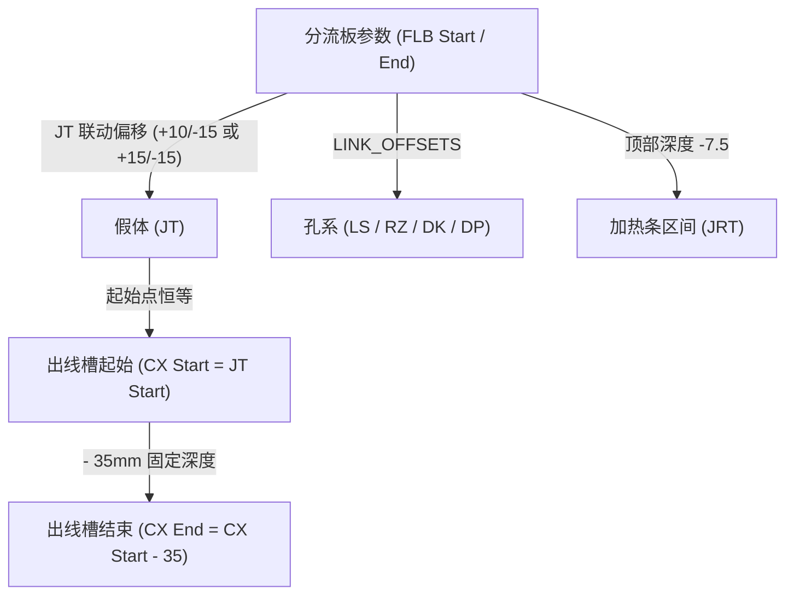

# NX 分层拉伸自动化 —— 使用手册（v2.2）

> **适用范围**：AutoCAD 2D 图纸（DWG / DXF）一键转 3D 热流道分流板、孔系布尔、标准件装配与 JRT 加热条自动化建模。  
> **支持环境**：Siemens NX 10 / NX 12 / NX 2312 及以上版本（兼容 Python 3.3 ~ 3.12+）。  
> **最后更新**：2026-09-04

---

## 目录
1. [系统概述与核心能力](#一系统概述与核心能力)
2. [文件与目录架构说明](#二文件与目录架构说明)
3. [快速上手（标准运行流程）](#三快速上手标准运行流程)
4. [AutoCAD 图纸规范与图层约定](#四autocad-图纸规范与图层约定)
5. [参数配置指南（nx_std_config.py）](#五参数配置指南nx_std_configpy)
6. [标准件归零与添加新零件](#六标准件归零与添加新零件)
7. [JT / CX / 加热条联动机制](#七jt--cx--加热条联动机制)
8. [低版本 NX（10/12）向下兼容操作](#八低版本-nx1012向下兼容操作)
9. [自动化冒烟与测试工具](#九自动化冒烟与测试工具)
10. [常见问题排查与避坑指南](#十常见问题排查与避坑指南)

---

## 一、系统概述与核心能力

本套工具通过 Siemens NX Journal（日记播放）运行，读取 AutoCAD 导出的 2D DXF 图纸，自动完成从 2D 线框到高精度 3D 实体的全流程建模：

1. **分层拉伸与布尔切割**：
   - 自动识别分流板（FLB）基准体轮廓；
   - 自动拉伸假体（JT）、出线槽（CX）等普通实体；
   - 自动拉伸螺丝孔（LS）、热咀孔（RZ）、点孔（DK）、垫片（DP）并从分流板上精准布尔减去（支持多通道板自动命中所属实体）。
2. **标准件自动装配与特征切割**：
   - 扫描 `stdparts\` 库中的标准件 `.prt` 文件；
   - 根据图纸圆心锚点自动计算三维空间位移与插入姿态（+Z 插入 / -Z 翻转）；
   - 通过组件装配（AddComponent）导入，利用实体提升（Promotion）和布尔运算在分流板上直接切槽或合体。
3. **JRT 加热条闭环建模**：
   - 自动解析加热条轮廓（支持 ≤1mm 细小断口自适应桥接）；
   - 自动完成两端工艺：嵌入端倒圆 → 出线口线删除面愈合 → 实体切槽 → 圆顶倒圆（内置异形检测与动态降 R 步长重试）；
   - 上下表面自动镜像生成双侧加热条，并设置独立着色与透明度。
4. **无参数化归整（去参）**：
   - 建模全流程完成后自动**移除参数**（Remove Parameters），清空特征树历史依赖，仅保留纯净几何哑实体（避免装配循环依赖与超大文件负担）。
5. **增量清理与无损重跑**：
   - 每次重新播放时，自动识别并清理上一轮生成的特征、体、组件与曲线，不影响用户在工作部件中自绘的非脚本图形。

---

## 二、文件与目录架构说明

本项目采用**自包含（Self-contained）**架构，脚本无论拷贝到任何盘符、文件夹或网络共享路径下，均能通过相对路径正确定位资源。

### 根目录核心文件清单

| 文件 / 目录 | 属性 | 作用与维护说明 |
|---|---|---|
| **`nx_extrude_runner.py`** | **入口门面** | **主日记入口**（320行兼容门面）。在 NX 中通过【工具 → 日记 → 播放】选择本文件即可启动全部功能。日常使用**切勿修改**。 |
| **`nx_std_config.py`** | **用户配置** | **核心参数配置文件**。集中管理标准件默认规则、Z 基准模式、各图层默认拉伸距离、加热条工艺参数、NX 图层号等。**业务调参请编辑此文件**。 |
| **`batch_smoke.py`** | **免命令行冒烟** | **端到端自动化测试脚本**。在 NX 里直接播放此文件，可在独立工作部件中全自动连续跑两遍真实图纸流水线，并生成测试报告。 |
| **`nx_extrude_params.json`** | **运行时记忆** | **交互记忆持久化文件**。记录用户在对话框中最后一次勾选的标准件、各层拉伸数值、选中的联动模式等。脚本自动维护，请勿手工篡改。 |
| **`cad3d/`** | **核心模块包** | 经架构解耦的核心 Python 代码包，包含 `core`（配置/状态）、`geom`（DXF/拓扑）、`modeling`（NXOpen建模）、`ui`（对话框/XML）、`pipeline`（流水线编排）、`selftest`（离线套件）。 |
| **`stdparts/`** | **标准件库** | 存放热咀、螺丝、垫片、接线盒等标准件 `.prt` 文件。 |
| **`tools/`** | **配套工具库** | 包含标准件归零工具（`nx_zero_ref.py`）、向下兼容工具包（`NX向下兼容工具/`）、DXF 提取与兼容性探测脚本。 |
| **`logs/`** | **运行生成物** | 存放每次运行生成的动态 BlockStyler `.dlx` 文件、执行报告 `nx_extrude_report.txt` 及调试日志。**整包可随时删除，下次运行自动重建**。 |
| **`test/`** | **测试资源** | 包含回归验证图纸（`fixtures/3Dtest.dxf`、`sample_layers.dxf`）与独立回归用例。 |

---

## 三、快速上手（标准运行流程）

### 1. 运行前准备
- 启动 Siemens NX（NX10 / NX12 / NX2312 均可）；
- 新建一个毫米（mm）建模部件，或打开已有的工作部件；
- 准备好待加工的 AutoCAD 2D 图纸（**v2.2 起直接支持 `.dwg` 图纸**，亦兼容 2000/2004/2007 格式的 `.dxf` 文件）。

### 2. 标准三段式交互流程

1. **启动脚本**：
   - 菜单栏点击：**【工具】(Tools) → 【日记】(Journal) → 【播放】(Play)**；
   - 在文件选择框中选中项目根目录的 **`nx_extrude_runner.py`**，点击运行。

2. **窗口①：标准件选择对话框**（有已配置标准件时弹出）：
   - 列表列出 `stdparts\` 中扫描到的所有标准件；
   - 勾选本次图纸需要装配的标准件（脚本自动记忆上次勾选；新添加的零件默认不勾选）；
   - 点击【确定】进入下一步；点击【取消】立即中止本次流程。

3. **窗口②：主参数与分层拉伸窗口**：
   - **图纸文件 (DWG / DXF)**：在顶部浏览并选择待处理的 `.dwg` 或 `.dxf` 文件；
     > 若选取的是 `.dwg`，系统将在后台自动静默转换为标准 DXF 并在建模结束后 100% 自动安全销毁清理，无需人工预先另存；
   - **JT 联动模式**：选择“普通模式”或“针阀模式”；
   - **分流板与各图层距离**：
     - 输入 `FLB` 的起始距离与结束距离（支持负坐标，如 `-40.0` 到 `-85.0`）；
     - 修改 `FLB` 数值时，其余各孔层（`LS`, `RZ`, `DK`, `DP`）以及假体（`JT`）、出线槽（`CX`）、加热条（`JRT`）会按工程预设联动偏移**自动推导跟随**；
     - 如有特殊工艺，可单独修改某一层数值；某层若“起始 == 结束”，该层自动跳过；
   - 点击【确定】完成参数暂存。

4. **窗口③：标准件参数微调窗口**（每件对应一个可收起组）：
   - 针对窗口①勾选的标准件，核对定位图层（如 `RZ`、`LS`）、Z 基准（如 `FLB_BOTTOM`、`FLB_TOP`）、偏移量（X/Y/Z）以及布尔模式；
   - 支持单件点击【恢复默认】按钮还原为出厂设置；
   - 点击【确定】（或【应用】）开始全自动建模！

5. **执行与输出**：
   - NX 信息窗口（ListingWindow）将逐行打印当前建模步骤与统计；
   - 运行完毕后，图形区自动重绘并呈现 3D 实体，特征树被清空（仅留去参哑实体），完成交付。

---

## 四、AutoCAD 图纸规范与图层约定

为确保自动化脚本能够精确提取轮廓和装配特征，AutoCAD 图纸请遵循以下图层命名与图元标准：

| 图层名称 | 典型图元 | 自动化建模行为 | 说明与工艺约束 |
|---|---|---|---|
| **`FLB`** | 封闭多段直线/圆弧 | **基准体拉伸** | 分流板主轮廓。必须封闭，支持双通道等多实体布局。其余减层将自动减入该实体。 |
| **`JT`** | 封闭多段直线/圆弧 | **普通拉伸** | 假体轮廓。拉伸为独立实体，不与 FLB 布尔。起止尺寸随 FLB 联动。 |
| **`CX`** | 封闭槽线轮廓 | **出线槽拉伸** | 普通独立实体。自动与 `CXK` 接线盒曲线并入闭环。 |
| **`CXK`** | 直线段（短线） | **仅定位参考，不拉伸** | 接线盒定位线。线段中点作为接线盒标准件的放置锚点，曲线参与 `CX` 闭环。 |
| **`LS`** | 圆（CIRCLE） | **布尔减去** | 螺丝孔。圆心作为 LS 标准件插入点，同时从 FLB 实体中减去贯穿穿孔。 |
| **`RZ`** | 圆（CIRCLE） | **布尔减去** | 热咀孔。圆心作为大水口/点胶口等标准件插入点，并在 FLB 上切除沉头型腔。 |
| **`DK`** | 圆（CIRCLE） | **布尔减去** | 点孔/销孔。拉伸后从 FLB 实体上布尔减去。 |
| **`DP`** | 圆或矩形环 | **布尔减去** | 垫片槽。支持内外同心嵌套环（外环为体，内环自动挖孔），并从 FLB 减去。 |
| **`JRT`** | 连续直线/圆弧链 | **加热条直建** | 加热条中心槽轮廓。必须封闭（允许 ≤1mm 细微断口），两端自动倒圆并愈合删除面。 |

> [!CAUTION]
> **严禁在建模图层使用多段线（`LWPOLYLINE`）**：  
> 本工具底层只解析标准的 `LINE`（直线）、`ARC`（圆弧）和 `CIRCLE`（整圆）。若图纸中存在未炸开的多段线，脚本会跳过该实体并在日志弹出警告。**请在 AutoCAD 中全选图形并执行 `EXPLODE`（炸开）命令后再另存 DXF。**

> [!NOTE]
> **图层安全保护区**：  
> 脚本将导入的 DXF 曲线统一放入 NX 图层 **11 ~ 70** 区间，并在每次运行前重置清理该区间。**用户自行绘制的参考线、毛坯模型请放置在图层 1 ~ 10 或 70 以后**，以防被当做历史生成物清除。

---

## 五、参数配置指南（nx_std_config.py）

当工程标准、材料厚度或零件型号变更时，直接修改根目录的 `nx_std_config.py`，无需改动任何代码。

### 1. 核心联动参数表（`LINK_OFFSETS`）
控制窗口②中修改 `FLB` 厚度时，其它各层距离的自动推导量：
```python
# 基准: FLB 顶面为 top, 底面为 bottom
# 默认普通模式: RZ 向上突出 13mm, DK 缩入 3mm, DP 台阶 6.7023mm
LINK_OFFSETS = {
    "LS":  (0.0, 0.0),                  # 与 FLB 同高
    "RZ":  (-32.0, 0.0),                # 相对 FLB 顶面与底面的偏移
    "DK":  (0.0, 42.0),
    "DP":  (-38.2977, 0.0),
}
```

### 2. JT / CX 联动模式切换（`JT_LINK_MODES`）
定义窗口②顶部下拉框可选的假体联动比例：
```python
JT_LINK_MODES = {
    "普通模式": (10.0, -15.0),          # JT起点 = FLB_top + 10; JT终点 = FLB_bottom - 15
    "针阀模式": (15.0, -15.0),          # JT起点 = FLB_top + 15; JT终点 = FLB_bottom - 15
}
JT_LINK_DEFAULT = "普通模式"
CX_LINK_END_OFFSET = 35.0               # CX 槽深固定 35mm (CX 终点 = CX 起始 - 35)
```

### 3. JRT 加热条工艺参数
```python
JRT_BLEND_R_DEFAULT = 3.9               # 加热条倒圆起始 R 值（mm）
JRT_R_STEP_DEFAULT  = 0.1               # 异形检测不过时的降级步长
JRT_R_MIN_DEFAULT   = 3.7               # 倒圆 R 值容忍下限
JRT_INTRUSION_DEFAULT = 7.5             # 加热条嵌入板内深度
JRT_DRAFT           = 2.0               # 拔模角度（度）
```

### 4. NX 高位图层分配与冲突智能避让（v2.1 新增）
系统默认将所有自动化生成的曲线放入 **101 ~ 170 高位图层**，把低位常用的 1 ~ 100 图层 100% 完整留给用户的日常自绘图形：
- `NX_LAYER_START = 101`：分流板 FLB=101, JT=102, LS=103, RZ=104, DK=105, DP=106, CX=107
- `NX_LAYER_JRT = 118`：JRT 加热条参考线
- `NX_LAYER_DYNAMIC_START = 119`：其余 DXF 图层从 119 起动态排布
- **智能避让机制**：若当前模型在 101~107 中已存在用户自绘图形，系统在建模前会自动探测，并智能滑动平移到一段连续干净的空闲图层（如 121~127），实现 100% 物理级零混层保护！

### 5. AutoCAD DWG 后台静默转换配置（v2.2 新增）
系统默认会在后台自动检测已安装的 AutoCAD 环境（注册表、常见安装路径及高低版本兼顾）：
- `ACAD_CONSOLE_PATH = None`：默认由系统全自动探测；
- 若您将 AutoCAD 安装在非系统默认盘符（例如 `D:\AutoCAD2024\accoreconsole.exe`），可在此填入具体可执行文件路径；
- 系统针对高版本（2013~2026+）采用无头极速引擎 `accoreconsole.exe`（耗时仅约 1 秒），对老版本（2004~2012）自动降级支持 `acad.exe` 批量模式；自带 `/readonly` 旗标，图纸正开着看图也能无感转换。

---

## 六、标准件归零与添加新零件

为彻底解决标准件在不同坐标系下插入位置偏移、每换一个零件就要手工测量坐标的繁琐问题，系统采用了**标准件原点归零机制**（自 v1.36 起）。

### 什么是归零？
标准件 `.prt` 建模时的原点（0, 0, 0）直接平移对准其理论插入定位点。归零后，在配置表里该零件的 `ref` 坐标恒为 `[0.0, 0.0, 0.0]`，再也无需人工维护三维坐标！

### 新增标准件三步法：

1. **平移归零**：
   - 若您新设计或导入的 `xxx.prt` 原点不在插入基准处，在 NX 中运行日记：选择 `tools\nx_zero_ref.py`；
   - 依序弹出点选窗口，在屏幕上捕捉拾取该零件的定位点，工具自动将几何整体平移并另存归零后的 `.prt`；
   - 将归零后的 `.prt` 放入根目录的 `stdparts\` 文件夹。

2. **配置默认规则**：
   - 打开 `nx_std_config.py`，在 `STD_PART_DEFAULTS` 表中追加一行精确文件名规则：
   ```python
   ("大水口-45.prt", {
       "layer": "RZ",                  # 依据 DXF 的 RZ 图层圆心定位
       "r_min": 0.0, "r_max": 20.0,    # 捕获图层圆的半径范围 (mm)
       "z_mode": "FLB_BOTTOM",         # 贴齐 FLB 底面
       "bool_mode": "PLACE_SUBTRACT",  # 放置并减去型腔
       "dir": "+Z",                    # 插入朝向
       "off_x": 0.0, "off_y": 0.0, "off_z": 0.0,
       "ref": [0.0, 0.0, 0.0],         # 已归零，恒写全 0
   }),
   ```

3. **运行验证**：
   - 播放 `nx_extrude_runner.py`，在窗口①中勾选新增的零件，在窗口③中确认其基准面与布尔模式后点击执行。

---

## 七、JT / CX / 加热条联动机制



- **全自动联动响应**：在窗口②中无论您调整 `FLB` 厚度还是切换“普通模式 / 针阀模式”，所有下游图层的起止距离均在毫秒级内自动按工程几何规范换算更新。
- **解耦保护**：出线槽 `CX` 的槽底深度独立锁定为 35mm，不会因假体 `JT` 终点的变动而发生槽底击穿板底的严重失误。

---

## 八、低版本 NX（10/12）向下兼容操作

NX 的 `.prt` 模型格式具有“**向下兼容，不向上兼容**”的特性（高版本 NX 保存的 `.prt` 无法在低版本 NX 中直接打开）。

如果您需要将本套工具部署至工厂的 **NX 10** 或 **NX 12** 电脑上：

1. **Python 脚本层面**：
   - 本套系统代码已通过全量 AST 兼容性审计，无任何 Python 3.6+ 高版本语法（严禁使用 f-string、类型注解、async 语法等）；
   - 在 NX 10（Python 3.3.2）与 NX 12（Python 3.6.1）上无需修改任何代码，均可直接运行！

2. **标准件模型还原操作**：
   - 进入目录：`tools\NX向下兼容工具\`；
   - 将该目录整体拷贝至目标低版本 NX 机器；
   - 双击执行目录内的 **`一键导入.bat`**；
   - 工具会自动调用本机低版本 NX 的后台程序，将通用的 Parasolid 格式（`xt\` 目录下）还原转换为当前机器版本的 `.prt` 文件（输出于 `x_t转prt\` 目录）；
   - 将生成的低版本 `.prt` 文件拷贝覆盖回根目录的 `stdparts\` 文件夹即可。

---

## 九、自动化冒烟与测试工具

为确保在任何新机器或交付环境中快速验证运行环境正常，系统内置了完备的自动化诊断手段：

### 1. 离线环境自动化断言自测（无需安装 NX）
在任何装有标准 Python 3 的电脑终端，执行：
```bash
python nx_extrude_runner.py --selftest
```
- **测试范围**：包含 165+ 项严格单元测试（覆盖 DXF 词法语法解析、图元构造、开链补缝、嵌套环面积父子深度、包围盒容错、配置降级、BlockStyler XML 合法性等）；
- 终端打印 `SELFTEST OK` 即代表核心算法完备无损。

### 2. 生成多图层测试 DXF
若手头没有现成的 CAD 图纸，可直接命令自动合成样例 DXF：
```bash
python nx_extrude_runner.py --make-sample-dxf test_layers.dxf
```

### 3. NX 实机一键端到端冒烟（`batch_smoke.py`）
- 在 NX 菜单中播放根目录的 **`batch_smoke.py`**；
- 脚本自动创建纯净临时部件，连续执行两遍真实工况流水线（验证“首次构建 + 清理后重建”均无残留且 100% 成功）；
- 最终在信息窗输出 `BATCH RESULT run1=True run2=True features=N`，并在 `logs\nx_extrude_report.txt` 输出全指标报表。

---

## 十、常见问题排查与避坑指南

### Q1：修改了 `nx_std_config.py`，但在对话框里没有生效？
- **原因**：NX 对话框优先读取上次保存在 `nx_extrude_params.json` 中的交互记忆。
- **解决方法**：在窗口③中点击该标准件的【恢复默认】按钮；或直接删除根目录下的 `nx_extrude_params.json`，重开对话框即可恢复全套出厂配置。

### Q2：修改了代码后在 NX 播放日记，行为似乎没有改变？
- **原因**：NX 图形会话驻留内存，Python 的 `sys.modules` 会缓存旧模块。
- **解决方法**：v2.0 门面已内置模块驱逐重载机制，保存文件后**直接重新播放**即可生效；若遇到深层 C++ 扩展残留，可重启一次 NX 会话。

### Q3：DXF 导入后部分图层轮廓没有生成 3D 实体？
- **排查步骤**：
  1. 查看 NX 信息窗口日志中的【解析】行；
  2. 若提示 `不支持的实体类型: LWPOLYLINE`，说明图纸中使用了多段线，请在 AutoCAD 中使用 `EXPLODE` 炸开后重新保存；
  3. 若提示 `开口链未闭合`，检查日志打印的断口坐标，在 CAD 对应位置补齐缺口。

### Q4：标准件没有被自动放置到分流板上？
- **排查步骤**：
  1. 检查窗口①中该标准件是否被勾选；
  2. 检查该标准件在配置表里的 `layer`（图层）和 `r_min ~ r_max`（半径区间）是否覆盖了图纸中的圆；
  3. 确认 `stdparts\` 文件夹下是否存在对应文件名的 `.prt`。

### Q5：如何完全清空历史运行缓存？
- 直接删除根目录下的 **`logs\`** 文件夹与 **`nx_extrude_params.json`** 文件即可。下次运行脚本会自动以初始状态重新生成。
